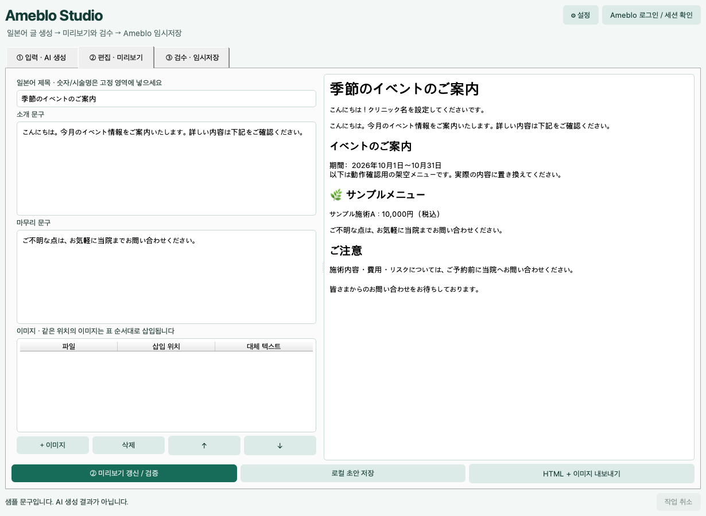

# Ameblo Studio — 데스크톱 MVP

**개발 상태: Experimental / 실제 계정 게시 미검증.** 개발 소스 공유용이며 안정판 배포가 아닙니다. [개발 참여](CONTRIBUTING.md) · [보안 안내](SECURITY.md)

한국어 화면에서 일본어 포스팅을 작성하고, 로그인한 Ameblo 브라우저에 제목·본문·이미지를 입력해 **임시저장**하는 독립 구현 Python 앱입니다. OpenAI/Gemini 선택, 고정 템플릿, 이미지 위치 지정, 로컬 초안 저장을 제공합니다.

> **검증 범위:** Windows 설치 파일 생성, 설치, 바탕화면/시작 메뉴 바로가기, GUI 시작 및 제거 테스트를 통과했습니다. 전체 테스트 36개도 통과했습니다. 실제 Ameblo 계정의 이미지 업로드·임시저장·공개 발행은 여전히 미검증입니다. 인증 후 DOM 선택자는 첫 사용 시 보정이 필요할 수 있습니다. [검증된 설치 파일 빌드](https://github.com/Junseo03L22/ameblo-studio/actions/runs/36550966025) · [테스트 보고서](docs/TEST_REPORT.md)



## 다운로드

**[Windows 설치 파일 다운로드](https://github.com/Junseo03L22/ameblo-studio/releases/download/v0.1.1/AmebloStudio-Setup-0.1.1-Windows-x64.exe)** · 약 360MB

[다운로드 페이지와 버전 안내](https://github.com/Junseo03L22/ameblo-studio/releases/tag/v0.1.1)

GitHub 계정 없이 다운로드할 수 있습니다. 초기 테스트 버전이며 실제 Ameblo 계정 업로드는 별도 검증이 필요합니다. 일반 사용자는 `Source code`가 아닌 `.exe` 설치 파일을 받으세요.

## Windows 사용자: 설치 후 아이콘으로 실행

배포된 `AmebloStudio-Setup-0.1.1-Windows-x64.exe`를 더블클릭해 설치합니다.
설치 화면의 **Create a desktop shortcut**은 기본 선택되어 있습니다.
설치 후 바탕화면 또는 시작 메뉴의 **Ameblo Studio**를 누르면 앱이 열립니다.
Python 설치나 PowerShell 명령 입력이 필요하지 않습니다. 사용자 계정에 설치하므로 관리자 권한도 요구하지 않습니다.
Windows 설정의 앱 목록에서 제거할 수 있으며, 기존 API 설정·로그인 세션은 앱 데이터 폴더에 유지됩니다.
설치 프로그램은 아직 코드 서명되지 않았습니다. 실제 Ameblo 게시 호환성은 별도 검증 대상입니다.

개발자는 Windows에서 Inno Setup 6을 설치하고 `scripts/build_windows.ps1`을 실행하면
`dist/installer/`에 설치 파일이 생성됩니다. GitHub **Windows desktop build**도 설치 파일을 만들고,
설치·바탕화면/시작 메뉴 바로가기·GUI 시작·제거를 테스트합니다.

## 1. 빠른 시작 (개발자용)

Python 3.12를 권장합니다. 프로젝트 ZIP을 풀고 **pyproject.toml이 있는 폴더**에서 실행합니다.

### Windows PowerShell

```powershell
py -3.12 -m venv .venv
.\.venv\Scripts\python.exe -m pip install -e ".[dev]"
.\.venv\Scripts\python.exe -m playwright install chromium
.\.venv\Scripts\python.exe -m ameblo_studio
```

또는 Python 3.12 설치 후 `scripts\run_windows.bat`를 더블클릭하세요. 최초 실행 때 라이브러리와 Chromium을 내려받으므로 인터넷이 필요합니다. 설치가 중간에 실패하면 위 수동 설치 명령으로 마무리하세요.

### macOS 개발 실행

```bash
python3 -m venv .venv
.venv/bin/python -m pip install -e '.[dev]'
.venv/bin/python -m playwright install chromium
.venv/bin/python -m ameblo_studio
```

Python이 없으면 [python.org](https://www.python.org/downloads/)에서 설치하세요. 개발 도구가 없는 macOS의 `/usr/bin/python3` 대신 설치한 Python을 사용하세요. PySide6의 지원 OS 범위는 설치 버전에 따라 다릅니다. 이번 검증에 사용한 버전은 [requirements-tested.txt](requirements-tested.txt)에 기록했습니다.

## 2. API 없이 먼저 보기

1. **샘플 입력** 클릭.
2. **API 없이 샘플 문구로 시작** 클릭.
3. 일본어 미리보기와 가격표가 나타납니다. 이 문구는 고정 샘플이며 AI 결과가 아닙니다.
4. 이미지를 추가하고 위치를 바꾼 다음 **미리보기 갱신 / 검증**을 누릅니다.

샘플 시술·가격·기간은 테스트용입니다. 실제 게시 전에 반드시 교체하세요.

## 3. 실제 작성 흐름

### 설정

- AI 공급자: OpenAI 또는 Gemini. 모델명은 편집 가능합니다. 기본값은 예시이며 계정에서 사용 가능한 모델을 지정하세요.
- API 키: 설정 화면에 입력하거나 `.env.example`을 `.env`로 복사해 입력합니다. API 이용 요금은 공급자에서 별도로 발생합니다.
- 환경변수 `OPENAI_API_KEY` / `GEMINI_API_KEY`가 로컬 설정 키보다 우선합니다.
- 설정 화면에 입력한 API 키는 로컬 `settings.json`에 **평문**으로 저장됩니다. macOS/Linux에서는 파일 권한 0600을 적용합니다. Windows에서는 사용자 프로필 접근 권한을 사용합니다. 키를 소스에 넣지 마세요.
- 배포 앱의 `.env`는 실행파일 옆이 아닌 **앱 데이터 폴더**에 둡니다. 개발 실행에서는 프로젝트 루트 `.env`도 읽습니다.
- 병원명, LINE, 진료시간, 인사말, 카테고리 소제목, 가격 표시, 이모지, 주의사항, 마무리 문구를 일본어로 설정합니다.
- 세션 이름은 영문·숫자·`_`·`-`로 입력합니다. 이름마다 별도 Ameblo 프로필을 사용합니다.

### ① 입력 · AI 글 생성

- **주제**: 한국어 가능. AI가 일본어 제목·소개·마무리를 작성합니다.
- **이벤트 정보**: 일본어로 입력. 날짜·조건·세금 표기 등은 입력 그대로 게시됩니다.
- **가격표**: 카테고리·시술명·가격/통화를 일본어로 입력. AI 번역이나 재작성 없이 그대로 조립합니다.
- **원문 메모**: AI 문체 참고용입니다. 메모 전체가 게시되는 것은 아닙니다.

AI에는 주제·메모·가격표의 금지 시술명 목록만 전송하며 가격·이벤트·이미지·로그인 쿠키는 전송하지 않습니다. **메모에 직접 적은 정보는 선택한 AI 공급자에게 전송**되므로 환자 개인정보나 비밀을 넣지 마세요.

### ② 편집 · 미리보기

- 생성된 일본어 제목·소개·마무리는 수정할 수 있습니다.
- 시술명과 금액은 AI 문구 영역에 중복 작성하지 말고 ①의 보호된 가격표에서 바꿉니다.
- 이미지 여러 장을 선택한 뒤 각 이미지의 **어느 본문 블록 뒤에 넣을지** 지정합니다. 같은 위치에서는 표 위→아래 순서이며 ↑↓로 바꿉니다.
- PNG/JPG/GIF, 각 3MB 이하, 앱 기준 최대 30장. 업로드 전에 파일 형식과 크기를 검사합니다.
- 이미지의 대체 텍스트도 입력할 수 있습니다.
- **미리보기 갱신 / 검증**은 필수입니다. 문구·이미지 파일이 변경되면 이전 검수는 무효가 됩니다.
- 로컬 초안 JSON에는 본문·템플릿·이미지 경로만 저장되며 API 키나 쿠키는 포함되지 않습니다. 이미지 경로는 로컬 절대 경로입니다. 다른 PC에서 열면 이미지를 다시 선택하세요.
- **HTML + 이미지 내보내기**는 공유 가능한 별도 폴더를 만듭니다. HTML 파일은 미리보기/수동 편집용이며 이미지는 Ameblo에 따로 업로드해야 합니다.

### ③ 검수 · Ameblo 임시저장

1. **Ameblo 로그인 / 세션 확인**을 누르면 전용 Chromium이 열립니다.
2. 직접 로그인하세요. 2단계 인증·CAPTCHA를 우회하지 않습니다. 로그인 대기는 최대 5분이며 취소할 수 있습니다.
3. 편집기 접근이 확인되면 브라우저가 닫히고 세션이 로컬 프로필에 남습니다. 앱에서 비밀번호를 수집하지 않으며 전용 프로필의 비밀번호 저장 기능을 끕니다.
4. ③ 탭에서 의료광고/가격 검수 체크 → **Ameblo 임시저장 준비**를 누릅니다.
5. 앱이 빈 편집기에 제목·본문·이미지를 채웁니다. 기존 글 내용이 있으면 덮어쓰지 않고 중단합니다.
6. 실제 브라우저 화면을 확인한 뒤 앱의 **브라우저 검수 완료 · 저장 진행**을 누릅니다. 검수 대기는 최대 10분입니다. 브라우저에서 내용을 수정하면 앱 미리보기와 불일치하여 저장이 차단됩니다.
7. 임시저장 완료 메시지까지 확인한 경우에만 완료로 표시합니다. 이후 Ameblo 글 목록에서 비공개 상태를 확인하세요.

**공개 발행:** 설정에서 활성화 → ③에서 이번 글 전체 공개 체크 → 공개 확인 → 브라우저 검수 순서입니다. 매 작업 후 이번 글 공개 체크는 해제됩니다. 공개 범위 라디오가 확인되지 않으면 발행하지 않습니다.

저장 클릭 후 네트워크/선택자 오류로 결과가 불확실할 때는 **자동 재시도하지 않습니다.** 동일 내용/이미지의 이전 시도 기록을 감지해 중복 가능성을 경고합니다. Ameblo 글 목록에서 먼저 확인하세요. 이미지 업로드 후 취소하면 이미지 파일이 서버에 남을 수 있습니다.

## 4. 템플릿 변수

| 항목 | 허용 변수 | 필수 변수 |
|---|---|---|
| 인사말 | `{clinic}` | 없음 |
| 카테고리 소제목 | `{emoji}`, `{category}` | `{category}` |
| 가격 행 | `{treatment}`, `{price}` | 둘 다 |

예: `{emoji} {category}` / `{treatment}：{price}`. 나머지 고정문구는 그대로 출력합니다. 임의 파이썬 표현식이나 HTML은 실행하지 않습니다. 모든 사용자 문구는 HTML 이스케이프합니다.

## 5. 의료광고 검수의 범위

가격·시술명·기간을 AI가 재작성하는 경로를 없앴습니다. AI 출력에서는 숫자, 주요 금액/수량 표현, 입력된 시술명, 일부 과장 문구, HTML, 일본어 누락을 검사합니다. 주의사항의 과장 의심 표현도 경고합니다.

그러나 이 검사는 번역 정확성이나 새로운 시술명/모든 의료적 주장, 법률 준수 여부를 완전하게 판별하지 못합니다. 입력 자체가 틀리면 그대로 게시됩니다. 실제 시술의 위험·부작용·대상·가격·통화·세금·기간·이미지 권리를 사람이 검수해야 합니다. 제공된 주의 문구만으로 광고 요건을 충족한다는 뜻은 아닙니다.

## 6. 계정·설정·진단 저장 위치

설정의 **로컬 설정 / 세션 / 로그 폴더 열기**에서 확인하세요.

- Windows: 일반적으로 `%LOCALAPPDATA%\AmebloStudio`
- macOS: `~/Library/Application Support/AmebloStudio`
- 환경변수 `AMEBLO_STUDIO_HOME`으로 변경 가능

```
settings.json        # 키를 UI에서 입력했다면 키 포함
.env                 # 선택 사항
selectors.json       # 사용자 선택자 설정
profiles/<세션>/      # 로그인 쿠키/세션 (공유 금지)
receipts/            # 동일 초안 저장 시도 상태
diagnostics/        # 실패 단계 JSON, 가능한 경우 스크린샷
```

스크린샷에는 본문/계정 정보가 포함될 수 있습니다. 비밀번호 입력칸은 마스킹하지만 계정명이나 글 내용은 보일 수 있습니다. 지원 요청 전에 직접 확인하세요. API 오류 응답 본문은 저장하지 않습니다. 브라우저 시작 자체가 실패하면 스크린샷을 얻을 수 없습니다. 설정 폴더를 통째로 공유하지 마세요. 세션을 없애려면 앱/브라우저를 닫고 해당 프로필 폴더를 삭제하세요.

한 PC에서는 동일 앱 데이터 폴더를 쓰는 앱 하나만 실행됩니다. 여러 사람이 공유할 때 각자의 PC에서 자신의 키와 Ameblo 세션을 설정합니다. 공동 클라우드 편집 기능은 없습니다.

## 7. Ameblo DOM 변경 대응

[SELECTORS.md](docs/SELECTORS.md)에 보정 절차와 지원 범위를 정리했습니다. 선택자는 `ameblo_studio/selectors.py`에 분리되어 있고 설정의 **고급 · DOM 선택자**에서 덮어쓸 수 있습니다. 현재는 일반 리치 에디터(contenteditable, iframe 포함)를 대상으로 하며 HTML 소스 전용 편집기는 지원하지 않습니다.

에러가 나면 공개 기능을 끈 채 새 테스트 글에서 확인하세요. 임시저장 버튼을 못 찾았다고 일반 제출 버튼으로 대체하지 않습니다. 정확한 임시저장 버튼 또는 선택 상태를 확인한 초안 라디오가 있어야 진행합니다. 선택자가 여러 요소와 일치하면 중단합니다.

## 8. Windows exe 배포

**Windows PC에서 빌드**해야 Windows exe가 나옵니다. macOS에서 Windows exe를 교차 빌드하지 않습니다.

```powershell
powershell -File scripts\build_windows.ps1
```

결과: `dist\AmebloStudio-Windows.zip`. 받는 사람은 ZIP을 풀고 `AmebloStudio\AmebloStudio.exe`를 실행합니다. **exe 파일만 떼어 공유하면 안 됩니다.** Qt와 Chromium이 들어 있는 전체 폴더가 필요하며 용량이 큽니다. 받는 사람은 Python 설치 없이 실행하도록 구성했습니다. Windows 빌드와 설치 후 GUI 시작은 GitHub Windows 실행 환경에서 검증했습니다. 실제 사용자 PC와 Ameblo 계정 검증은 별도입니다.

GitHub 저장소에 이 프로젝트를 올린 뒤 Actions의 **Windows desktop build**를 수동 실행하는 구성도 포함했습니다. 워크플로 실행과 설치 파일 생성·설치 검증을 완료했습니다. 코드 서명은 별도이며 미서명 배포물에 OS 경고가 나타날 수 있습니다.

macOS 빌드는 `sh scripts/build_macos.sh`를 사용합니다. 대상 아키텍처의 macOS에서 빌드하고 배포용 서명/공증은 별도로 처리하세요. 배포 전 의존성 고지는 [THIRD_PARTY.md](THIRD_PARTY.md)를 확인하세요.

## 9. 테스트

```bash
python -m pytest -q                         # Chromium 설치/실행 가능한 환경
python -m pytest -m 'not browser' -q        # 브라우저 없이 핵심·GUI 테스트
```

공급자 테스트는 모의 API 응답을 사용하며 실제 키/과금 호출을 사용하지 않습니다. 브라우저 테스트는 로컬 HTML fixture를 사용하고 실제 Ameblo에는 게시하지 않습니다. 실제 계정 인수 테스트 목록은 [TEST_REPORT.md](docs/TEST_REPORT.md)에 있습니다.

## 10. 프로젝트 구조

```
ameblo_studio/
  gui.py          한국어 GUI, 백그라운드 작업, 검수 흐름
  ai.py           OpenAI Responses / Gemini generateContent
  content.py      보호된 값 조립, 템플릿, 검증, HTML 렌더링
  models.py       입력/초안/설정 데이터 모델
  publisher.py    Playwright 세션, 이미지, 본문 입력, 저장, 진단
  selectors.py    DOM 후보 선택자와 사용자 오버라이드
  storage.py      로컬 설정/초안, 원자적 저장, 프로필
scripts/          Windows/macOS 실행·빌드 스크립트
tests/           단위·GUI·브라우저 회귀 테스트
docs/            구조 분석, 선택자 설명, 테스트 보고서
```

## 11. 원본 참고와 라이선스

[Better Life Naver](https://github.com/cd000242-sudo/naver)의 구조·라이선스를 검토했습니다. 원본은 AGPL-3.0-or-later이며 별도 상용 라이선스 안내가 있습니다. 원본 코드는 복사하지 않았습니다. 생성→검증→이미지→게시라는 구조적 아이디어만 참고하고 PySide6/Playwright로 새로 작성했습니다. 분석은 [ARCHITECTURE.md](docs/ARCHITECTURE.md)를 참조하세요.

이 프로젝트 소스는 MIT. 외부 패키지·Chromium·Qt는 각각의 라이선스가 적용됩니다. 자동화 사용 시 Ameba의 이용 조건과 계정 운영 정책을 확인하세요.
